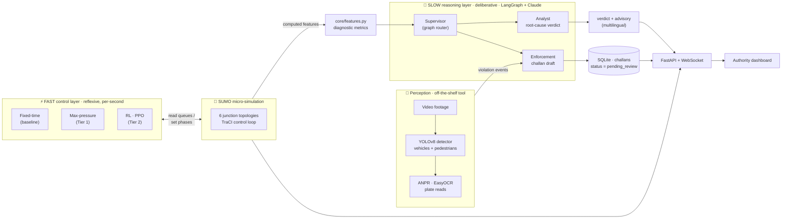

<div align="center">

# 🚦 Saarthi · सारथी

### An agentic decision-support system for traffic authorities

*It watches a junction, optimizes its signals in real time, explains **why** it congests, and tells the authority what to do about it — in plain language, in Indian languages.*

<br>


<br>

> ### **−44.6% average vehicle wait** — fixed-time `132.4 s` → smart adaptive `73.3 s`
> *Measured in SUMO on the rush-hour scenario, same demand, same junction. This number is reproducible in one command.*

</div>

---

*Saarthi* (सारथी, "the charioteer who guides") is **not** a commuter app. Its one user is the **control-room operator / enforcement officer**. It pairs a **fast, reflexive signal controller** with a **slow, deliberative reasoning layer** so a single junction is both *optimized* and *explained* — then it drafts the enforcement paperwork and writes the advisory in the officer's language.

## Table of contents

- [🚦 Saarthi · सारथी](#-saarthi--सारथी)
    - [An agentic decision-support system for traffic authorities](#an-agentic-decision-support-system-for-traffic-authorities)
  - [Table of contents](#table-of-contents)
  - [🎯 The problem \& the thesis](#-the-problem--the-thesis)
  - [🏗 Architecture — two decision speeds](#-architecture--two-decision-speeds)
    - [The agent roster](#the-agent-roster)
  - [🔧 Backend deep-dive](#-backend-deep-dive)
    - [1 · Simulation layer (SUMO)](#1--simulation-layer-sumo)
    - [2 · Fast control layer (the reflexes)](#2--fast-control-layer-the-reflexes)
    - [3 · Slow reasoning layer (the spine)](#3--slow-reasoning-layer-the-spine)
    - [4 · Perception (the off-the-shelf tool)](#4--perception-the-off-the-shelf-tool)
    - [5 · Storage \& the web backend](#5--storage--the-web-backend)
  - [✨ Feature tour](#-feature-tour)
  - [🧰 Tech stack](#-tech-stack)
  - [🚀 Setup](#-setup)
  - [▶️ How to run](#️-how-to-run)
  - [🎬 The demo flow](#-the-demo-flow)
  - [📁 Project structure](#-project-structure)
  - [📊 Results \& honest caveats](#-results--honest-caveats)
  - [🔭 Future scope](#-future-scope)

---

## 🎯 The problem & the thesis

Traffic authorities run junctions on **fixed-time signal plans** that ignore live demand, and they diagnose congestion from gut feel. Two things are missing:

1. **Control that reacts to the road**, not to a timer.
2. **An explanation an operator can act on** — *why* is this junction backing up, and *what* should we do — phrased in plain language, in the operator's own language.

**The thesis (the spine of the whole project):**

| Layer | Role | Investment |
|---|---|---|
| 🧠 **Reasoning** (root-cause + advice) | The differentiator. The thing a human couldn't do at scale. | **Most of the effort.** |
| 🚦 **Control** (adaptive signals) | The measurable floor. Beats fixed-time, provably. | Solid, benchmarked. |
| 🎥 **Perception** (detection, ANPR) | An off-the-shelf *tool* the system calls. | Deliberately shallow. |

The **proof** is a quantified **before/after wait-time reduction** measured in simulation. That number — currently **−44.6%** — is the headline, and it is fully reproducible (`scripts/run_benchmark.py`).

---

## 🏗 Architecture — two decision speeds

Saarthi deliberately splits decision-making across **two clocks**. This is the answer to *"is this RL or is it agentic?"* — **it is both, by design**, each doing what it is good at.



**The split:**

- **⚡ Fast layer (heuristic / RL):** reflexive, second-by-second signal decisions at one junction, optimizing wait time. The signal changes *because the road state changed*, not because a countdown expired.
- **🧠 Slow layer (LLM agents via LangGraph + Claude):** deliberative root-cause attribution, plain-language judgment, multilingual advice, and human-review enforcement.

The two layers meet at **`core/features.py`**: the simulation is distilled into *computed diagnostic features* (queue imbalance, peak windows, pedestrian-phase backup). The LLM reasons over **numbers it can defend**, never raw logs.

### The agent roster

| Agent | File | Job |
|---|---|---|
| **Supervisor** | `agents/supervisor.py` | A LangGraph `StateGraph` holding shared state; conditionally routes `START → analyst → enforcement → END`. New agents = new nodes + routing rules. |
| **Analyst** | `agents/analyst.py` | Takes the feature dict + benchmark, returns a **structured** `RootCauseVerdict` (cause breakdown %, recommendation, expected impact, confidence, temporal note). |
| **Enforcement** | `agents/enforcement.py` | Judges a violation, drafts a challan in the citizen's language, persists it as `pending_review`. **Never auto-issues.** |

---

## 🔧 Backend deep-dive

### 1 · Simulation layer (SUMO)

Everything provable happens inside **Eclipse SUMO**, driven over **TraCI**. SUMO ships via the `eclipse-sumo` pip wheel, and `config/settings.py` **auto-discovers `SUMO_HOME`** from that package — no shell setup required.

**Junction topologies** (`sim/network_defs.py`) — six networks are generated programmatically and built on demand with `netconvert` (sidewalks + signalized crossings), all centred on world origin `(0,0)` so vehicle/pedestrian positions stream to the renderer in one coordinate frame:

| Network | Character |
|---|---|
| `cross` | Balanced 4-way, 2 lanes/approach — the classic case |
| `tee` | 3-arm T-junction — turning conflicts dominate |
| `asym` | 3-lane arterial × 1-lane side street — strong asymmetry |
| `highway` | 6-lane high-capacity 4-way |
| `boulevard` | 3-lane boulevard × 2-lane cross-street |
| `roundabout` | Metered roundabout — cars circulate the ring while a shared TLS meters each entry (so the signal method matters here too) |

**Demand scenarios** (`sim/routes/*.rou.xml` + `sim/scenarios/*.sumocfg`) — five 1-hour profiles that **double as the Analyst's temporal data**:

| Scenario | Demand character |
|---|---|
| `rush` | Heavy E–W arterial (650/h) vs light N–S side street (220/h) — big room for adaptive gain |
| `weekday` | Directional commute imbalance (inbound > outbound) |
| `weekend` | Balanced flows + **heavy pedestrian** load (480 ped/h) — pedestrian-responsive control earns its keep |
| `offpeak` | Light all round — the honest "no congestion" data point |
| `baseline` | Moderate balanced reference |

**The live-simulation engine** (`sim/live.py`) powers the interactive lab. From dashboard parameters (per-axis vehicle rate, pedestrian rate, traffic mix `cars`/`mixed`) it generates demand, runs the chosen controller via TraCI, and exposes three consumption styles:
- `stream_frames()` — rich per-vehicle / per-pedestrian frames for the live canvas (positions, angle, speed, vehicle type, **pedestrian waiting state**);
- `steps()` — coarse per-step state (queues, phase, running wait);
- `run_combo()` — headless batch run → `(final metrics, queue timeline)` for the comparison matrix.

> **Pedestrians as first-class citizens.** Crossing demand is spawned *near the junction* and routed across the signalized crossings, so people visibly queue at the kerb and stream across on the WALK phase — directly exercising the pedestrian-responsive controller. Final metrics always come from SUMO's `tripinfo`, so the numbers are auditable.

### 2 · Fast control layer (the reflexes)

All controllers share one interface (`control/base.py`: `observe → decide → apply` via `reset()` + `step(sim_time)`) and one phase model (`control/phases.py`: a `NS / EW / PED` green→yellow→all-red→green state machine). `classify()` discovers each junction's controlled links at runtime, so the code is never tied to a hand-counted signal string.

| Controller | File | How it decides |
|---|---|---|
| **Fixed-time** *(baseline / "before")* | `control/fixed_time.py` | A demand-blind cycle: `NS 30s → EW 30s → PED 13s`, forever. Serves pedestrians every cycle even when none are waiting. |
| **Max-pressure** *(Tier 1 / "after")* | `control/max_pressure.py` | No fixed cycle. Each step (after a min-green) it reads live per-lane queues via TraCI and serves the phase with the greatest **pressure** (queued vehicles). A busy arterial gets more green than a quiet side street. |
| **RL** *(Tier 2, optional)* | `control/rl/` | A PPO policy that learns the phase schedule. |

**Pedestrian-responsive phasing** is built into max-pressure: the exclusive PED phase is served **on demand and skipped when empty**, but *when* it is inserted self-adapts to vehicle load — slipped in cheaply while a vehicle phase has drained, or deferred under heavy traffic until a fairness cap guarantees pedestrians are never starved.

**Tier 2 — Reinforcement Learning** (`control/rl/env.py`, `control/rl/rl_controller.py`): a **custom Gymnasium environment** (deliberately *not* `sumo-rl`, so the RL agent shares the exact `NS/EW/PED` phase model as the others — a fair benchmark). Trained with **Stable-Baselines3 PPO**:
- **Observation** (6-D): normalized NS queue, EW queue, pedestrian waiting count, and the current phase (one-hot).
- **Action**: `Discrete(3)` → target phase `NS / EW / PED`.
- **Reward**: shaped on **total wait reduction**, where `total wait = vehicle wait + 2× pedestrian wait` — pedestrians are weighted up so the policy can't cheat by starving the crossing, and accumulating wait on stuck vehicles penalizes gridlock.
- **Hard guardrail: single junction only.** `scripts/train_rl.py` promotes RL into the benchmark **only if it beats max-pressure without gridlock or pedestrian starvation**; otherwise it falls back cleanly. (On `rush` it currently reaches **−77.8%**.)

### 3 · Slow reasoning layer (the spine)

This is where the project spends its intelligence.

**Step A — computed features** (`core/features.py`). A scenario is run and distilled into a JSON-able dict so the LLM reasons over **defensible numbers**, not raw logs:

```
overall              → avg vehicle wait, avg ped delay, avg/peak queue, counts
per_approach_queue   → {N,S,E,W}: {avg, peak}
directional_imbalance→ ns vs ew avg queue, dominant_axis, imbalance_ratio
temporal             → time-bucketed queues, peak_window, queue_trend (rising/falling/stable)
pedestrians          → avg/peak waiting, ped_phase_time_share, ped_phase_backup_ratio
```

**Step B — the LLM wrapper** (`core/llm.py`). A thin **`langchain-anthropic`** client around **Claude (`claude-opus-4-8` by default)**:
- `structured(prompt, PydanticModel)` → schema-constrained output via `.with_structured_output()` (no brittle JSON parsing);
- `chat(prompt)` → free text;
- `render_in_language(text, language)` → authority-facing translation.
- Resilient by design: `LLMNotConfigured` / `LLMError` are raised and **caught everywhere**, so a missing key or a rate limit degrades gracefully instead of crashing the pipeline.

**Step C — the Analyst** (`agents/analyst.py`) returns a `RootCauseVerdict` (`core/models.py`):

```python
RootCauseVerdict:
  headline, primary_cause                       # plain language
  cause_breakdown: {vehicles, pedestrians, parking}   # % attribution, sums ~100
  recommendation, expected_impact               # what to do + quantified benefit
  justification                                 # cites the actual computed numbers
  temporal_note                                 # "congests 6–8pm on weekdays"
  confidence                                    # 0–1
```

The system prompt forbids the model from naming algorithms ("max-pressure", "RL", "SUMO") — the operator gets *insight*, not jargon. Helpers add **multilingual output** (`advisory_text`, `render_in_language`, `translate_verdict`, `translate_details`) and **temporal pattern** narration. A **deep-dive** (`core/insights.py`, `build_detailed_report`) pins the worst congestion episodes, the longest-waiting vehicles, and the pedestrian peak, then asks Claude for a `DetailedAnalysis` (diagnosis → evidence → prioritized actions → expected outcome).

**Step D — Enforcement** (`agents/enforcement.py` + `core/violations.py`). `detect_violations()` runs a short simulation where ~20% of drivers over-speed, records genuine over-the-limit instances (plate, approach, speed, time), and the agent drafts a `ChallanDraft` — judging validity, assembling evidence, proposing an INR fine, and writing the notice **in the citizen's language**. Every challan lands in SQLite as `pending_review`. **Nothing is ever auto-issued — human-in-the-loop, always.**

**Step E — the Supervisor** (`agents/supervisor.py`) wires it together as a LangGraph `StateGraph` whose `SaarthiState` carries `features → verdict → violation_event → challan`, routing `START → analyst → enforcement → END`. It's the extension point: a new agent is a new node plus a routing rule.

### 4 · Perception (the off-the-shelf tool)

Kept **deliberately shallow** — it's a tool the system calls, not the thesis:

- **`perception/detector.py`** — **Ultralytics YOLO** (`yolov8n.pt`, auto-downloaded). Counts vehicles + pedestrians (the COCO `person` class gives pedestrian counts for free), with optional tracking for unique IDs.
- **`perception/anpr.py`** — plate detection + **EasyOCR** + a canonical Indian-plate regex (`MH12AB1234`). A **POC on clear, frontal footage** — accuracy is documented honestly.
- **`perception/parking.py`** — separates **stationary vs moving** vehicles across frames to flag lane-narrowing **parking encroachment**, feedable to the Analyst as a third root-cause factor.

### 5 · Storage & the web backend

**SQLite** (`core/db.py`) — a single `challans` table (plate, violation_type, evidence, fine, draft notice, language, confidence, **`status` defaulting to `pending_review`**, timestamps). Officer actions (`approved` / `rejected`) flow through `update_status()`; `clear_pending()` resets the un-reviewed queue per run while keeping the decided record.

**FastAPI backend** (`backend/app.py`, `backend/analysis_ws.py`) serves a single-page canvas dashboard and a real API surface:

| Kind | Endpoint | Purpose |
|---|---|---|
| **WS** | `/api/ws/simulate` | One parameterized SUMO run → streams per-vehicle/pedestrian frames |
| **WS** | `/api/ws/experiment` | Controllers × networks comparison matrix with progress |
| **WS** | `/api/ws/analyze` | The **full reasoning pipeline**, streamed live (simulate → features → verdict → advisory → enforcement) |
| **REST** | `/api/benchmark`, `/api/verdict/{s}`, `/api/advisory/{s}`, `/api/temporal`, `/api/perception` | Real pipeline outputs |
| **REST** | `/api/challans`, `/api/challans/{id}/{status}` | Challan queue + officer approve/reject |
| **REST** | `/api/networks`, `/api/scenarios`, `/api/details/{s}`, `/api/prefs`, `/api/health` | Catalogue, deep-dive, prefs, health |

A single `threading.Lock` enforces **one TraCI connection at a time**; SUMO runs in a worker thread and frames are marshalled to the event loop over an `asyncio.Queue`.

> The frontend is a dependency-light vanilla **canvas + Chart.js** SPA (no build step). It's intentionally thin — the value lives in the backend above.

---

## ✨ Feature tour

- **⚡ Real-time adaptive control** — max-pressure beats fixed-time on every layout tested, with a **reproducible before/after number**.
- **🧠 Root-cause attribution** — a structured, confidence-scored verdict grounded in computed features, in plain language.
- **🗣 Multilingual advisory** — the verdict + challans render in **Hindi, Tamil, Telugu, Kannada, Marathi, Bengali, Gujarati, Punjabi, Malayalam** (output-side only; AI-translated and cached).
- **🚸 Pedestrian-responsive phasing** — an on-demand WALK phase, served when people gather and skipped when the kerb is empty, visible live on the canvas.
- **📋 Human-review enforcement** — over-speeding vehicles are caught, challans drafted, **nothing auto-issued**.
- **🕒 Temporal analysis** — the Analyst reports time-of-day / day-of-week congestion patterns across the rush/weekday/weekend/offpeak scenarios.
- **🤖 RL Tier-2 (optional)** — a PPO policy that, when it converges, slots in as a third benchmark bar.
- **🧪 Experiments lab** — run any controller × layout matrix headless and compare wait, pedestrian delay, and queue timelines.

---

## 🧰 Tech stack

| Concern | Tool |
|---|---|
| Simulation | Eclipse **SUMO** + `traci` / `sumolib` (via `eclipse-sumo` wheel) |
| Adaptive control (Tier 1) | Custom **max-pressure** over TraCI |
| RL (Tier 2) | Custom **Gymnasium** env + **Stable-Baselines3** (PPO) |
| Perception | **Ultralytics YOLO** · **EasyOCR** · OpenCV |
| Agents | **LangGraph** + **langchain-anthropic** (Claude `claude-opus-4-8`) |
| Backend | **FastAPI** + Uvicorn + WebSockets |
| Storage | **SQLite** |
| Data / models | **pydantic** v2 · pandas · matplotlib |
| Frontend | Vanilla JS canvas + **Chart.js** (no build step) |

---

## 🚀 Setup

**Prerequisites:** Python **3.11+** and `pip`. (No system SUMO build needed — the wheel bundles the binaries.)

```bash
# 1. Clone + virtual environment
git clone <repo-url> saarthi && cd saarthi
python3.11 -m venv .venv && source .venv/bin/activate

# 2. Install dependencies (SUMO wheel + agents + perception + backend + RL)
pip install -r requirements.txt

# 3. Configure secrets
cp .env.example .env
#    → set ANTHROPIC_API_KEY=sk-ant-...   (required for the reasoning layer)
```

**Environment variables** (`.env`):

| Variable | Required? | Default |
|---|---|---|
| `ANTHROPIC_API_KEY` | ✅ for reasoning/enforcement | — |
| `ANTHROPIC_MODEL` | optional | `claude-opus-4-8` |
| `SUMO_HOME` | optional (auto-discovered from the wheel) | — |
| `SUMO_GUI`, `SIM_SEED`, `SIM_STEP_LENGTH`, `SIM_DURATION` | optional | `false`, `42`, `1.0`, `3600` |

> **No Anthropic key?** The simulation, control, benchmark, and live canvas all still work — only the AI verdict/advisory/challan steps degrade gracefully with a clear message.

**Sample footage (optional, for perception):** drop a clip into `data/videos/` (ideally an Indian junction with visible plates) and point `scripts/run_perception.py` at it.

---

## ▶️ How to run

```bash
# ── The web app (recommended): live sim + analysis + enforcement ──
python scripts/run_app.py                 # → http://127.0.0.1:8001

# ── Reproduce the headline before/after number ──
python scripts/run_benchmark.py rush      # fixed-time vs max-pressure (+ --rl)
#   → prints the % wait reduction, saves data/outputs/benchmark.{json,png}

# ── The reasoning pipeline (root-cause verdict + advisory) ──
python scripts/run_analysis.py rush --advisory-lang Hindi --temporal

# ── The fixed-time baseline only ──
python scripts/run_baseline.py

# ── Perception on a clip ──
python scripts/run_perception.py data/videos/clip.mp4

# ── Draft a challan (human-review enforcement) ──
python scripts/run_enforcement.py --lang Hindi

# ── Train the optional RL Tier-2 policy (single junction) ──
python scripts/train_rl.py --timesteps 24000 --scenario rush

# ── One-shot demo prep (idempotent: fills any missing outputs) ──
python scripts/run_demo.py
```

Run the test suite with `pytest` (47 tests, no SUMO/AI key required for most).

---

## 🎬 The demo flow

1. **Live Simulation** — pick a layout, drag the demand sliders, hit **Run**. Watch cars queue and pedestrians cross; the smart controller reacts to the road in real time.
2. **Before vs After** — flip to A/B mode: the *same* demand under today's fixed timer vs smart adaptive, side-by-side, synchronized. The wait drops from **365 s → 54 s** on screen.
3. **Analysis & Enforcement** — hit **Run AI analysis** and watch the pipeline stream: simulate → find the pattern → find the cause → advise → enforce.
4. **The verdict** — a confidence-scored root cause with a concrete recommendation and expected impact.
5. **The advisory** — toggle to **Hindi**; the whole analysis re-renders in the operator's language.
6. **The challan** — open the queue: drafted over-speeding notices await an officer's approve/reject. Nothing was auto-issued.

---

## 📁 Project structure

```
saarthi/
├── sim/                    # SUMO assets + live engine
│   ├── network_defs.py     #   6 junction topologies (built via netconvert)
│   ├── live.py             #   parameterized live-sim engine (frames/steps/combo)
│   ├── routes/             #   rush/weekday/weekend/offpeak/baseline demand
│   └── scenarios/          #   .sumocfg + loader (SUMO_HOME plumbing)
├── control/                # FAST layer
│   ├── base.py · phases.py #   controller interface + NS/EW/PED state machine
│   ├── fixed_time.py       #   baseline ("before")
│   ├── max_pressure.py     #   Tier-1 adaptive ("after") + ped-responsive
│   └── rl/                 #   Tier-2: Gymnasium env + PPO controller
├── agents/                 # SLOW layer (LangGraph + Claude)
│   ├── supervisor.py · analyst.py · enforcement.py
├── core/                   # the reasoning substrate
│   ├── features.py         #   computed diagnostic features
│   ├── metrics.py          #   wait/queue metrics + tripinfo parsing
│   ├── insights.py         #   deep-dive report
│   ├── violations.py       #   over-speed detection
│   ├── llm.py · models.py · db.py
├── perception/             # off-the-shelf tool: detector · anpr · parking
├── backend/                # FastAPI app + WebSocket pipeline + canvas SPA (static/)
├── scripts/                # runnable entry points (see "How to run")
├── data/outputs/           # benchmark, verdicts, advisories, challans (SQLite)
```

---

## 📊 Results & honest caveats

**Headline — `rush` scenario, identical demand (2,502 vehicles, 240 pedestrians):**

| Controller | Avg vehicle wait | vs fixed-time | Avg ped delay |
|---|---|---|---|
| Fixed-time (baseline) | `132.4 s` | — | `41.0 s` |
| **Max-pressure (Tier 1)** | **`73.3 s`** | **−44.6%** | `38.0 s` (−7.3%) |
| RL · PPO (Tier 2) | `29.3 s` | −77.8% | `33.6 s` |

**Caveats, stated plainly:**
- **ANPR** is a POC: it reads clear, frontal, well-lit plates. Real CCTV angles/motion-blur would need a production ANPR stack.
- **RL** is trained on a **single junction**; the −77.8% is genuine on `rush` but RL is *optional upside*, not the load-bearing claim. Max-pressure is the dependable floor.
- **Parking encroachment** detection is implemented but lightly weighted — the heaviest CV lift, the lowest-scored layer.
- All numbers come from **SUMO `tripinfo`** and are reproducible; none are mocked.

---

## 🔭 Future scope

Saarthi is built as a spine you can extend. Natural next integrations:

**Control & scale**
- **Multi-junction / corridor coordination** — graph-based or multi-agent RL to green-wave an arterial (today: deliberately single-junction).
- **Transit & emergency priority** — signal preemption for buses/ambulances detected by perception.
- **Hardware-in-the-loop** — a TraCI↔controller-cabinet bridge (NTCIP) to drive real signal controllers from the same policy.

**Reasoning & data**
- **Live data ingestion** — replace simulated demand with real loop-detector / camera / GPS-probe feeds so the Analyst reasons over *today's* junction.
- **Counterfactual "what-if" agent** — let an operator ask "what if I add a left-turn phase?" and have the system simulate + answer.
- **A planner agent** above the supervisor that sequences multi-step interventions and tracks outcomes over days (closing the loop with a learned memory).
- **Retrieval over policy & incident history** so advice is grounded in this city's past decisions.

**Perception & enforcement**
- **Production ANPR** (fine-tuned detector + super-resolution) and red-light / wrong-way / no-helmet violation classes.
- **Parking-encroachment severity → capacity model**, feeding lane-narrowing back into the controller, not just the advisory.
- **Officer workflow integration** — push approved challans to an actual e-challan / RTO system via API (with audit trail).

**Platform**
- **Multi-junction operations dashboard** with city-wide heatmaps and alerting.
- **Edge deployment** — quantized YOLO + the controller on a junction-side device; the reasoning layer in the cloud.
- **Voice / WhatsApp advisory** for field officers in regional languages.

---

<div align="center">
<br>

**Saarthi** — real-time smart signals that cut waiting · AI that explains the cause and advises in your language · automatic violation flagging.
*Every number comes from a live traffic simulation.*

</div>
